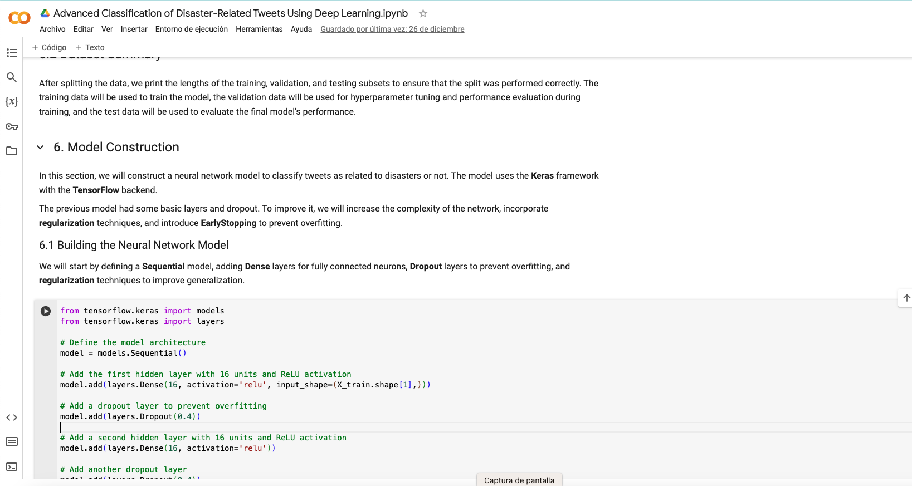
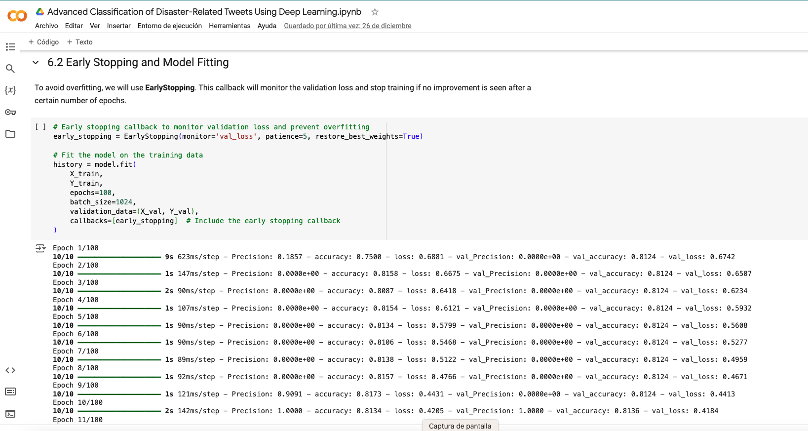
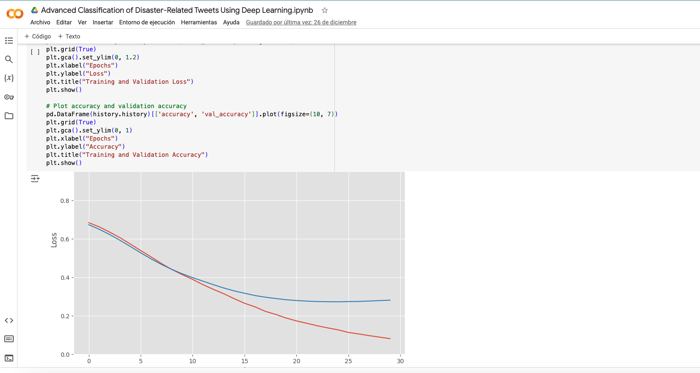
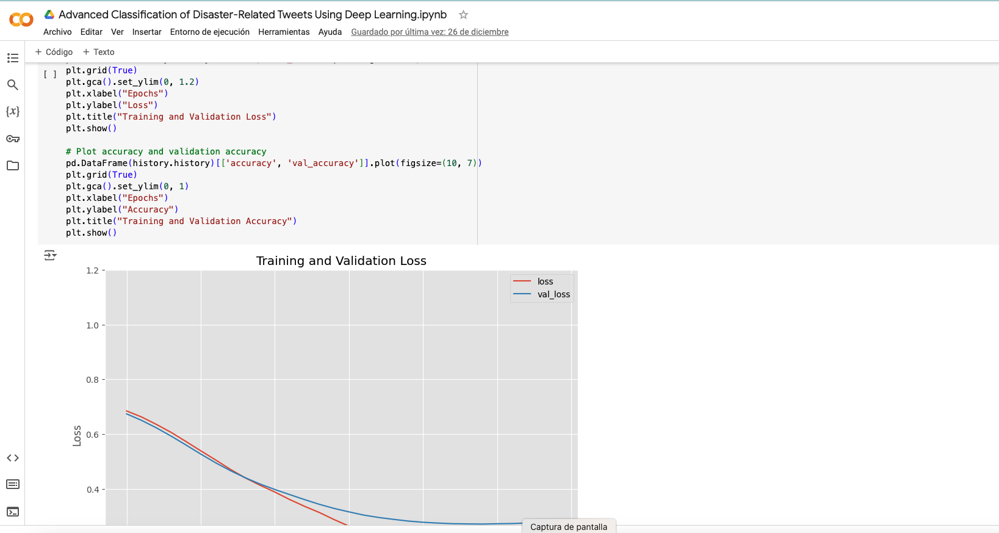

# 🌍 Advanced Classification of Disaster-Related Tweets Using Deep Learning 🚨

In this project, I am tackling an exciting challenge: **classifying tweets** to determine whether they’re related to disasters or not. Using cutting-edge **deep learning** techniques, this model sifts through tweet data and helps us understand how **social media** reacts to crises in real-time. Inspired by the **"NLP with Disaster Tweets"** challenge, this project is enhanced with additional data to give us deeper insights into disaster-related topics.

<p align="center">
   
   
   
   
   
   
   
</p>

🙏 I would like to extend my heartfelt gratitude to [Santiago Hernández, an expert in Cybersecurity and Artificial Intelligence](https://www.udemy.com/user/shramos/). His incredible course on Deep Learning, available at Udemy, was instrumental in shaping the development of this project. The insights and techniques learned from his course were crucial in crafting the neural network architecture used in this classifier.

## 🌟 Explore My Other Deep Learning Projects! 🌟  

If you found this project intriguing, I invite you to check out my other cutting-edge deep learning initiatives:  

+ [📰 Fighting Misinformation: Source-Based Fake News Classification 🕵️‍♂️](https://github.com/sergio11/fake_news_classifier)  
In a world plagued by fake news, this project tackles the challenge of **authenticity in journalism**. Using **source-based analysis** and **machine learning**, I aim to classify news articles as real or fake, promoting a more informed and responsible media ecosystem.

+ [💳 Fraud Detection Model with Deep Neural Networks (DNN)](https://github.com/sergio11/online_payment_fraud)  
Fraudulent transactions can cause immense financial losses. This project leverages **Deep Neural Networks** to detect fraud in financial data, even in highly imbalanced datasets. Learn about my process, from **Exploratory Data Analysis (EDA)** to building a **scalable and efficient solution** for fraud detection. 

+ [🛡️ IoT Network Malware Classifier with Deep Learning Neural Network Architecture 🚀](https://github.com/sergio11/iot_network_malware_classifier)  
The Internet of Things (IoT) is transforming the world, but it also introduces new security challenges. This project leverages **Deep Learning Neural Networks** to classify and detect malware in IoT network traffic. By analyzing patterns with AI, it provides **proactive cybersecurity solutions** to safeguard interconnected devices. Explore the intricate process of model design and training with the **Keras framework**, detailed in the accompanying Jupyter Notebook.

+ [Spam Email Classification using LSTM 📧🤖](https://github.com/sergio11/spam_email_classifier_lstm)
This project uses a Bi-directional LSTM model 📧🤖 to classify emails as spam or legitimate, utilizing NLP techniques like tokenization, padding, and stopword removal. It aims to create an effective email classifier 💻📊 while addressing overfitting with strategies like early stopping 🚫.

+ [🧠🚀 AI-Powered Brain Tumor Classification](https://github.com/sergio11/brain_tumor_classification_cnn)  
🧠🚀 AI-Powered Brain Tumor Classification: Leveraging Deep Learning with CNNs and Transfer Learning to classify brain tumors from MRI scans, enabling fast and accurate diagnostics. 🌐⚡

+ [Predicting Diabetes Diagnosis Using Machine Learning 📊💉](https://github.com/sergio11/diabetes_prediction_ml)
Predicting diabetes using machine learning models based on medical data 📊💉. The goal is to create an accurate and reliable diagnostic tool for early detection 🏥🤖.

Take a dive into these projects to see how **deep learning** is solving real-world problems and shaping the future of AI applications. Let's innovate together! 🚀

## **📊 Dataset Overview**

### **🗺️ The Dataset**

This [dataset](https://www.kaggle.com/datasets/vstepanenko/disaster-tweets) includes over **11,000 tweets** focused on major disasters, like the **COVID-19 outbreak**, **Taal Volcano eruption**, and the **bushfires in Australia**. It’s a snapshot of how people react and communicate during global crises.

The data includes:
- **Tweets**: The text content of the tweet 📱
- **Keywords**: Disaster-related keywords like “earthquake” or “flood” 🌪️
- **Location**: Geographical information when available 🌍

Collected on **January 14th, 2020**, it represents critical moments in recent history, including:
- The **Taal Volcano eruption** (Philippines 🌋)
- **COVID-19** (global pandemic 🦠)
- **Bushfires in Australia** (Australia 🔥)
- The **Iranian downing of flight PS752** (international tragedy ✈️)

### **⚠️ Caution**

This dataset contains tweets that may include **offensive language** 😬. Please proceed with caution during analysis.

## **🎯 Project Goals**

### **💡 Why I am Doing This**

The goal of this project is clear: build a **deep learning model** that can classify tweets as related to disasters or not. Here's how we're approaching it:

1. **Enriching the dataset**: By adding manually classified tweets, we can boost the quality and size of our dataset 📈.
2. **Building a robust model**: Using **deep learning** and **NLP** techniques to extract meaningful features from the data 🔍.
3. **Classifying tweets**: The model will distinguish between disaster-related and non-disaster tweets, helping us understand patterns in social media behavior during crises.

### **💪 Why This Matters**

Why is it important to classify disaster-related tweets? Here are a few reasons:
- **Emergency Response**: Helps first responders prioritize real-time, crucial information 🆘.
- **Better Resource Allocation**: Directs attention to actual disasters and helps prevent the spread of misinformation 🤖.
- **Misinformation Control**: Filters out false information during global crises and ensures people are getting accurate updates 📉.

## **🔧 Methodology**

### **1. Data Preprocessing** 🧹

Before we can train our deep learning model, we need to clean up the data. This includes:
- **Removing URLs**: Twitter links won’t help us classify the content, so we remove them 🔗❌.
- **Eliminating Emojis**: While fun, emojis don't add value in this classification task 😜❌.
- **Removing HTML Tags & Punctuation**: Ensuring we’re working with clean text 🌐✂️.
- **Tokenizing the Text**: Breaking down the tweets into individual words or tokens 🧠.

### **2. Model Architecture** 🏗️

The deep learning model implemented for this project follows a **feedforward neural network** architecture designed to classify disaster-related tweets. Here's an overview of the model structure:

1. **Input Layer**:  
   The model takes in preprocessed tweet data as input, where each tweet is represented by a vector of features (after vectorization using TF-IDF). The shape of the input is `(X_train.shape[1],)` which corresponds to the number of features for each tweet.

2. **Hidden Layers**:  
   - The first hidden layer has **16 neurons** and uses the **ReLU (Rectified Linear Unit)** activation function. ReLU is commonly used for its ability to introduce non-linearity and prevent the vanishing gradient problem.
   - A **Dropout Layer** with a rate of **0.4** follows the first hidden layer to prevent overfitting by randomly setting 40% of the input units to 0 during training.
   - The second hidden layer also consists of **16 neurons** and utilizes the **ReLU** activation function.
   - Another **Dropout Layer** with a rate of **0.4** is added to further mitigate overfitting.

3. **Output Layer**:  
   The output layer consists of a **single neuron** with a **sigmoid activation function**, which is suitable for binary classification tasks like this one (disaster vs. non-disaster tweet). The output will be a probability score between 0 and 1, where values closer to 1 indicate a disaster tweet.

4. **Compilation**:  
   The model is compiled using the **Adam optimizer** (a popular choice for training deep learning models) and **binary cross-entropy** loss, which is appropriate for binary classification tasks. Additionally, **accuracy** and **precision** metrics are used to evaluate the performance of the model.



### **3. Training the Model** ⏳

To ensure the model is trained effectively and prevents overfitting, I use the following methodology:

1. **Early Stopping**:  
   An **EarlyStopping** callback is used during training to monitor the validation loss. The training process stops if the validation loss does not improve for **5 consecutive epochs** (defined by the `patience` parameter). This helps in preventing the model from overfitting the training data by stopping the training once it starts to generalize poorly.

2. **Model Fitting**:  
   The model is trained for a maximum of **100 epochs** with a batch size of **1024**. The training process is monitored with validation data (`X_val`, `Y_val`), allowing us to track the model’s performance on unseen data during training.



### **4. Evaluation & Insights** 📊

After training, I evaluate the model’s performance on real-world examples to see how well it classifies tweets related to disasters.

1. **Prediction on Example Tweets**:  
   A set of example tweets is preprocessed using the same vectorizer applied to the training data. Then, the model predicts whether each tweet is related to a disaster or not. The output is a binary label (0 or 1), where 1 indicates a disaster-related tweet and 0 indicates a non-disaster tweet.

   Example tweets:
   - "A 6.2 magnitude earthquake has struck Concepción. Coastal areas should evacuate due to tsunami risk."
   - "A red alert has been issued for wildfires in the Valparaíso region. Residents are urged to evacuate immediately and follow emergency instructions."
   - "Strong shaking felt in the area. Possible aftershocks."
   - "Due to heavy rainfall, the Paraná River has overflowed, causing floods in Santa Fe province. Donations of food and clothing are needed."
   - "Smoke in the air. Stay indoors and monitor local news."
   - "River levels rising. Avoid low-lying areas. Stay informed."



2. **Visualization of Loss and Accuracy**:  
   The training and validation loss, as well as accuracy, are plotted to visualize the model’s performance over time. These plots help us understand how well the model is learning during training and whether it is overfitting or generalizing well to the validation data.

   - **Loss**: Tracks how well the model minimizes the loss function during training.
   - **Accuracy**: Tracks the percentage of correct predictions the model makes on both training and validation data.



## **📉 Results**

### **Training Progress**

We track the model’s progress using **training and validation loss**, as well as **accuracy**. This helps us understand how well the model is learning and improving during the training process.

## **🔮 Conclusion**

I successfully built a **deep learning model** capable of classifying tweets as disaster-related or not. The model performs well in distinguishing between **genuine disaster tweets** and **irrelevant content**, which is crucial for **emergency response** and **misinformation control** during crises.

## **🌟 Future Work**

I am not stopping here! There’s still a lot of potential to enhance this project:
- **More Data**: The dataset can be further expanded with more labeled tweets from different events and locations 🌎.
- **Advanced Models**: Experiment with other techniques like **Word2Vec** or **BERT** for even better text representations 📚.
- **Real-Time Deployment**: Imagine deploying this model for **real-time disaster monitoring** on Twitter 🐦.

## **📚 References**
- [Keras Documentation](https://keras.io/)
- [TensorFlow Documentation](https://www.tensorflow.org/)
- [NLP with Disaster Tweets Challenge](https://www.kaggle.com/c/nlp-getting-started)

## **🙏 Acknowledgments**

A huge **thank you** to **Vstepanenko** for providing the dataset that made this project possible! 🌟 The dataset can be found on [Kaggle](https://www.kaggle.com/datasets/vstepanenko/disaster-tweets). Your contribution is greatly appreciated! 🙌

🙏 I would like to extend my heartfelt gratitude to [Santiago Hernández, an expert in Cybersecurity and Artificial Intelligence](https://www.udemy.com/user/shramos/). His incredible course on Deep Learning, available at Udemy, was instrumental in shaping the development of this project. The insights and techniques learned from his course were crucial in crafting the neural network architecture used in this classifier.

## Visitors Count


## Please Share & Star the repository to keep me motivated.
<a href = "https://github.com/sergio11/disasters_prediction/stargazers">
   
</a>

## License ⚖️

This project is licensed under the MIT License, an open-source software license that allows developers to freely use, copy, modify, and distribute the software. 🛠️ This includes use in both personal and commercial projects, with the only requirement being that the original copyright notice is retained. 📄

Please note the following limitations:

- The software is provided "as is", without any warranties, express or implied. 🚫🛡️
- If you distribute the software, whether in original or modified form, you must include the original copyright notice and license. 📑
- The license allows for commercial use, but you cannot claim ownership over the software itself. 🏷️

The goal of this license is to maximize freedom for developers while maintaining recognition for the original creators.

```
MIT License

Copyright (c) 2024 Dream software - Sergio Sánchez 

Permission is hereby granted, free of charge, to any person obtaining a copy
of this software and associated documentation files (the "Software"), to deal
in the Software without restriction, including without limitation the rights
to use, copy, modify, merge, publish, distribute, sublicense, and/or sell
copies of the Software, and to permit persons to whom the Software is
furnished to do so, subject to the following conditions:

The above copyright notice and this permission notice shall be included in all
copies or substantial portions of the Software.

THE SOFTWARE IS PROVIDED "AS IS", WITHOUT WARRANTY OF ANY KIND, EXPRESS OR
IMPLIED, INCLUDING BUT NOT LIMITED TO THE WARRANTIES OF MERCHANTABILITY,
FITNESS FOR A PARTICULAR PURPOSE AND NONINFRINGEMENT. IN NO EVENT SHALL THE
AUTHORS OR COPYRIGHT HOLDERS BE LIABLE FOR ANY CLAIM, DAMAGES OR OTHER
LIABILITY, WHETHER IN AN ACTION OF CONTRACT, TORT OR OTHERWISE, ARISING FROM,
OUT OF OR IN CONNECTION WITH THE SOFTWARE OR THE USE OR OTHER DEALINGS IN THE
SOFTWARE.
```

